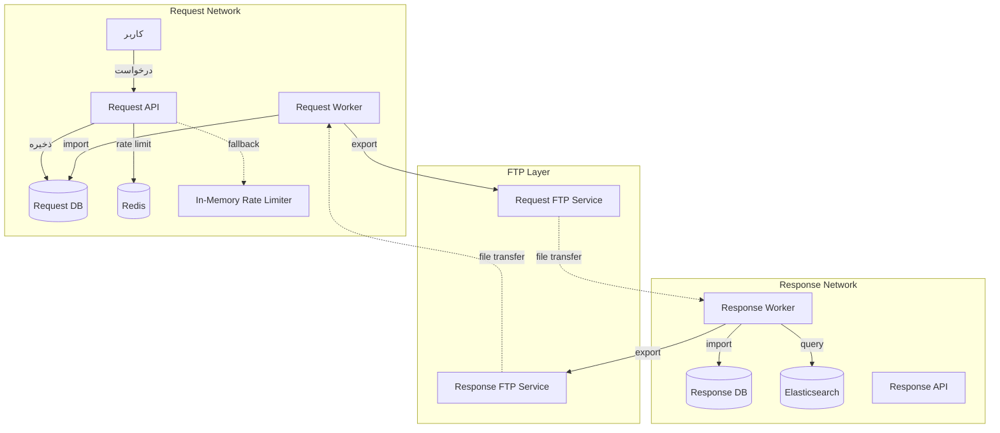
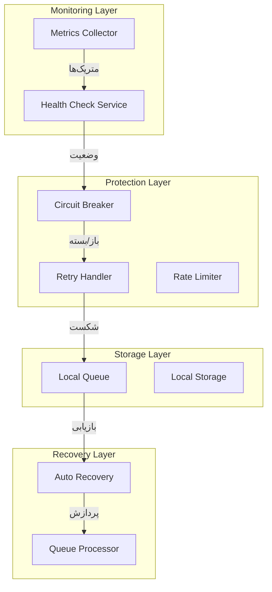
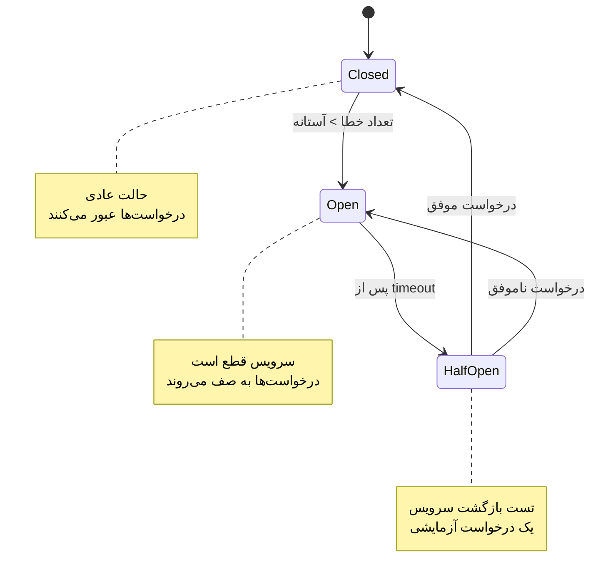
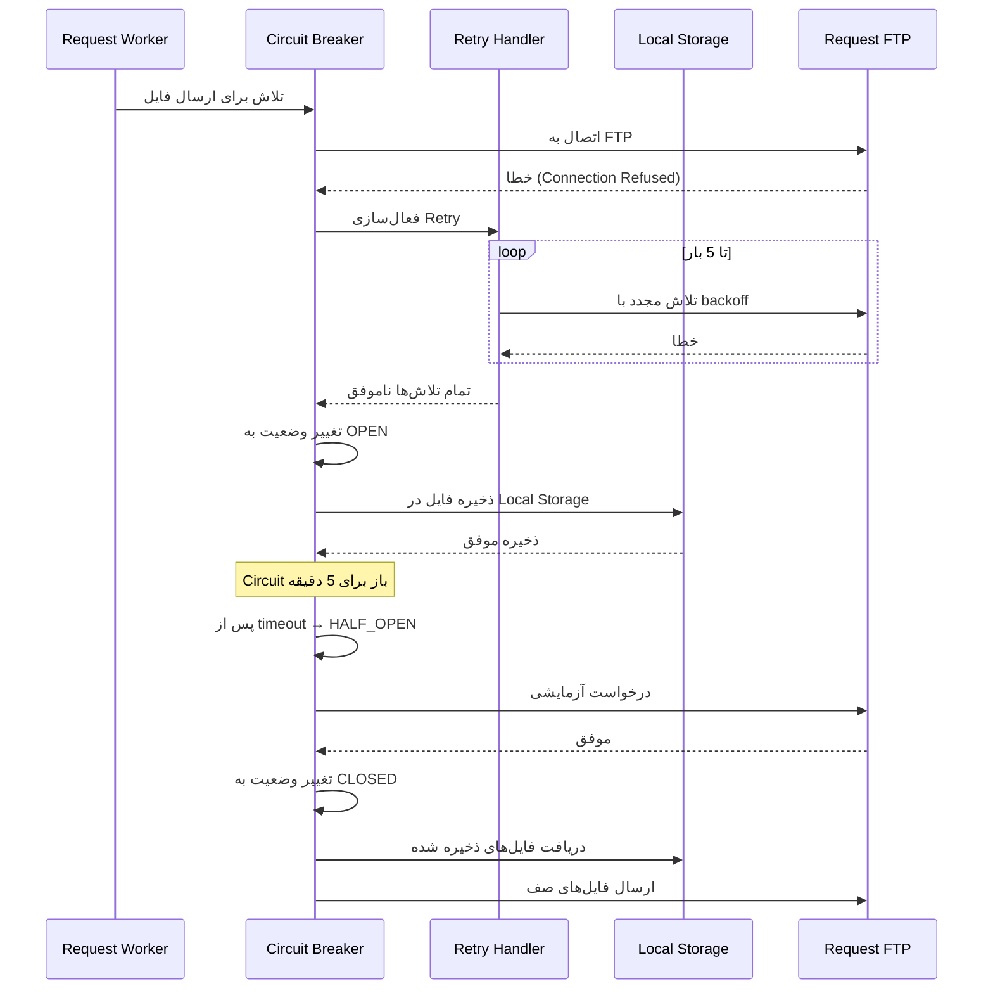
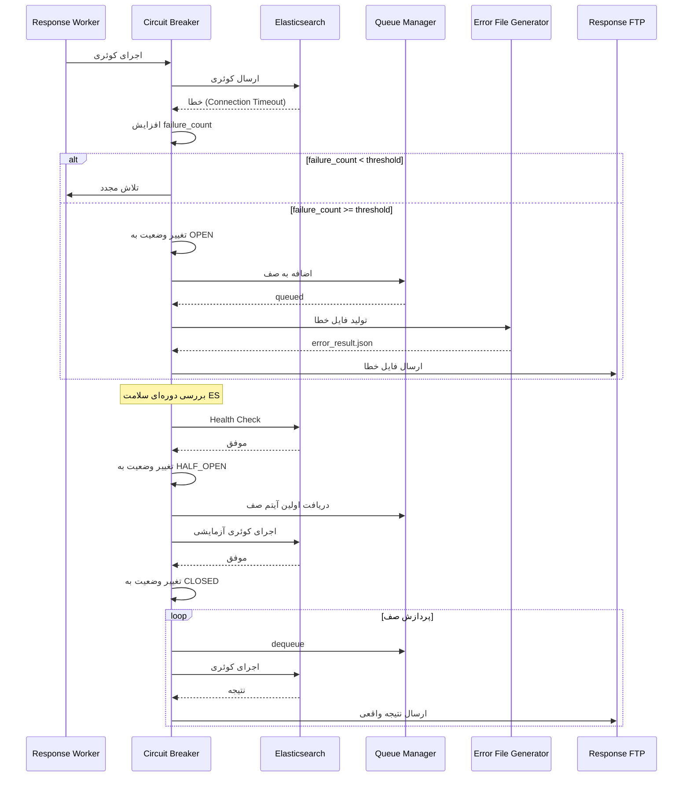
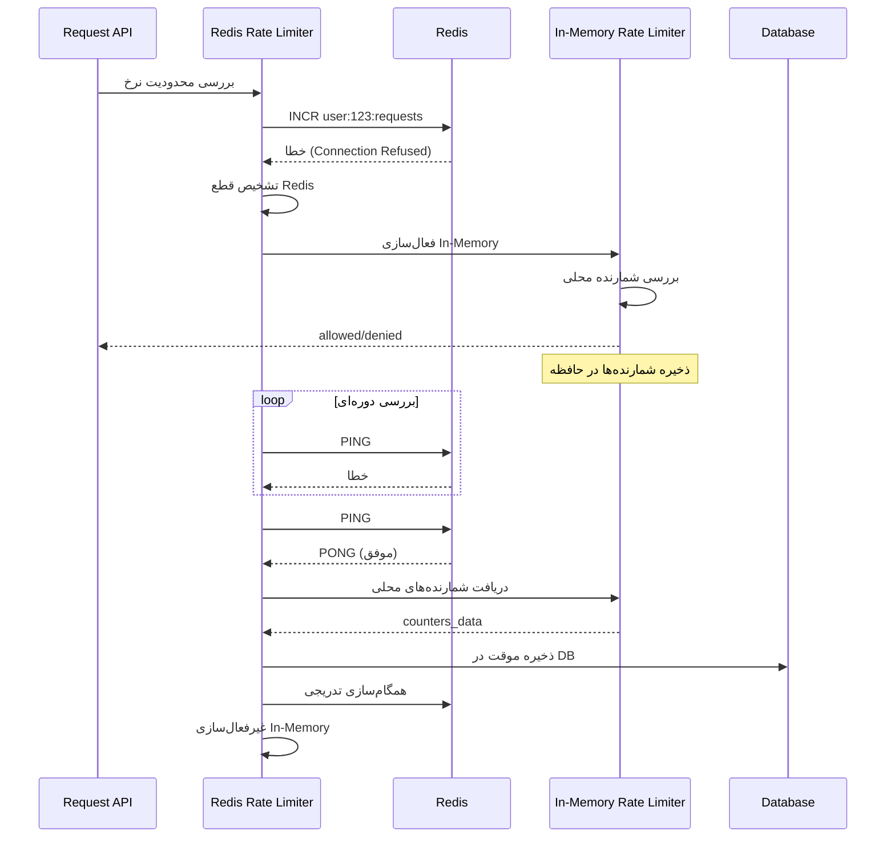
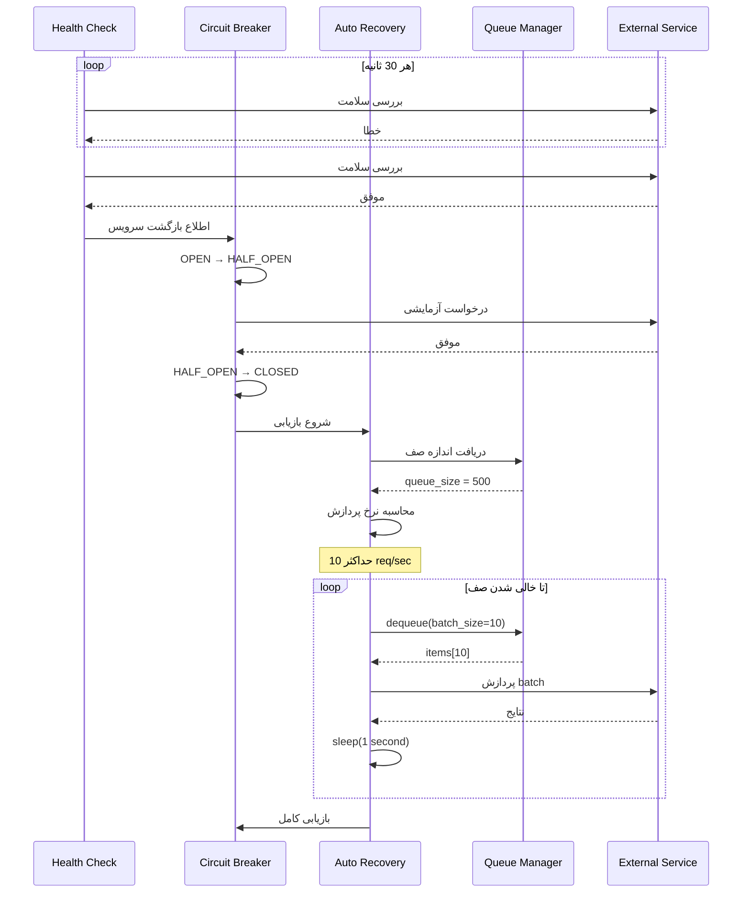

# سند طراحی: پایداری و استحکام سامانه

## مقدمه

این سند طراحی فنی برای پیاده‌سازی فیچر پایداری و استحکام سامانه است. هدف اصلی، ایجاد یک معماری مقاوم در برابر قطع دسترسی به سرویس‌های خارجی حیاتی (FTP، Elasticsearch، Redis) است که سامانه را قادر می‌سازد تا در شرایط خطا به عملکرد خود ادامه دهد و پس از بازگشت سرویس‌ها به صورت خودکار بازیابی شود.

## بررسی کلی (Overview)

### زمینه و انگیزه

سامانه فعلی به سه سرویس خارجی حیاتی وابسته است:

1. **سرورهای FTP**: برای همگام‌سازی داده بین Request_Network و Response_Network
   - Request_FTP_Service: دریافت فایل‌های درخواست
   - Response_FTP_Service: ارسال فایل‌های نتیجه

2. **Elasticsearch**: برای اجرای کوئری‌ها و جستجوی داده‌ها

3. **Redis**: برای محدودسازی نرخ (rate limiting) و کش کردن داده‌ها

قطع دسترسی به هر یک از این سرویس‌ها می‌تواند منجر به از دست رفتن درخواست‌های کاربران، عدم پاسخ‌دهی سامانه، یا تجربه کاربری ضعیف شود. این طراحی با استفاده از الگوهای معماری مقاوم (Resilience Patterns) این مشکلات را حل می‌کند.

### اهداف طراحی

1. **پایداری (Availability)**: حفظ عملکرد سامانه حتی با قطع موقت سرویس‌ها
2. **قابلیت بازیابی (Recoverability)**: بازگشت خودکار به حالت عادی پس از بازگشت سرویس‌ها
3. **شفافیت (Transparency)**: اطلاع‌رسانی واضح به کاربران در مورد وضعیت درخواست‌ها
4. **قابلیت مانیتورینگ (Observability)**: ارائه متریک‌ها و لاگ‌های جامع برای نظارت
5. **قابلیت پیکربندی (Configurability)**: امکان تنظیم پارامترهای resilience بدون تغییر کد

### محدوده طراحی

**در محدوده:**
- مدیریت قطع دسترسی به Request_FTP، Response_FTP، Elasticsearch، Redis
- پیاده‌سازی Circuit Breaker، Retry Handler، Queue Management
- سیستم Health Check و مانیتورینگ
- بازیابی خودکار و پردازش صف‌ها
- محدودسازی نرخ In-Memory به عنوان fallback

**خارج از محدوده:**
- تغییرات در منطق اصلی پردازش کوئری‌ها
- بهینه‌سازی عملکرد Elasticsearch
- تغییرات در معماری Air-Gap
- پیاده‌سازی High Availability برای خود سرویس‌ها

## معماری (Architecture)

### معماری کلی سامانه

سامانه دارای معماری دو شبکه‌ای با Air-Gap است:



### معماری Resilience

معماری پایداری شامل چهار لایه اصلی است:



### ماشین حالت Circuit Breaker



## کامپوننت‌ها و رابط‌ها (Components and Interfaces)

### ۱. Connection Monitor

**مسئولیت**: مانیتورینگ مداوم وضعیت سرویس‌های خارجی

**رابط عمومی**:
```python
class ConnectionMonitor:
    def check_service_health(self, service_name: str) -> HealthStatus
    def get_service_status(self, service_name: str) -> ServiceStatus
    def get_all_statuses(self) -> Dict[str, ServiceStatus]
    def register_health_callback(self, service_name: str, callback: Callable)
```

**ساختار داده**:
```python
@dataclass
class HealthStatus:
    is_healthy: bool
    response_time_ms: int
    last_check_at: datetime
    error_message: Optional[str]

@dataclass
class ServiceStatus:
    service_name: str
    is_healthy: bool
    consecutive_failures: int
    last_success_at: Optional[datetime]
    last_failure_at: Optional[datetime]
    uptime_percentage: float
```

**پیاده‌سازی**:
- بررسی سلامت هر ۳۰ ثانیه (قابل تنظیم)
- استفاده از thread pool برای بررسی‌های موازی
- ذخیره تاریخچه در Redis (اگر در دسترس باشد) یا حافظه

### ۲. Circuit Breaker

**مسئولیت**: جلوگیری از تلاش‌های مکرر به سرویس‌های از کار افتاده

**رابط عمومی**:
```python
class CircuitBreaker:
    def __init__(self, 
                 service_name: str,
                 failure_threshold: int = 5,
                 timeout_seconds: int = 300,
                 half_open_max_calls: int = 1)
    
    def call(self, func: Callable, *args, **kwargs) -> Any
    def get_state(self) -> CircuitState
    def reset(self) -> None
    def force_open(self) -> None
```

**ماشین حالت**:
```python
class CircuitState(Enum):
    CLOSED = "closed"      # عملکرد عادی
    OPEN = "open"          # سرویس قطع - درخواست‌ها رد می‌شوند
    HALF_OPEN = "half_open"  # تست بازگشت سرویس
```

**پیاده‌سازی**:
- یک instance جداگانه برای هر سرویس
- ذخیره وضعیت در دیتابیس برای persistence
- استفاده از decorator pattern برای سهولت استفاده

### ۳. Retry Handler

**مسئولیت**: تلاش مجدد هوشمند با Exponential Backoff

**رابط عمومی**:
```python
class RetryHandler:
    def __init__(self,
                 max_retries: int = 5,
                 initial_delay: float = 5.0,
                 max_delay: float = 300.0,
                 exponential_base: float = 2.0)
    
    def execute_with_retry(self, 
                          func: Callable,
                          *args,
                          **kwargs) -> RetryResult
```

**ساختار داده**:
```python
@dataclass
class RetryResult:
    success: bool
    result: Any
    attempts: int
    total_time: float
    last_error: Optional[Exception]
```

**الگوریتم Exponential Backoff**:
```
delay = min(initial_delay * (exponential_base ** attempt), max_delay)
delay_with_jitter = delay * (0.5 + random.random() * 0.5)
```

### ۴. Queue Manager

**مسئولیت**: مدیریت صف‌های محلی برای ذخیره موقت داده‌ها

**رابط عمومی**:
```python
class QueueManager:
    def enqueue(self, queue_name: str, item: QueueItem) -> bool
    def dequeue(self, queue_name: str) -> Optional[QueueItem]
    def peek(self, queue_name: str, count: int = 10) -> List[QueueItem]
    def get_size(self, queue_name: str) -> int
    def clear(self, queue_name: str) -> int
```

**ساختار صف**:
```python
@dataclass
class QueueItem:
    id: UUID
    queue_name: str
    data: Dict[str, Any]
    priority: int
    created_at: datetime
    retry_count: int
    max_retries: int
    metadata: Optional[Dict[str, Any]]
```

**پیاده‌سازی**:
- استفاده از جدول دیتابیس برای persistence
- اولویت‌بندی بر اساس priority و created_at
- محدودیت حداکثر اندازه صف (قابل تنظیم)

### ۵. In-Memory Rate Limiter

**مسئولیت**: محدودسازی نرخ زمانی که Redis در دسترس نیست

**رابط عمومی**:
```python
class InMemoryRateLimiter:
    def __init__(self, 
                 max_requests: int = 100,
                 window_seconds: int = 60)
    
    def is_allowed(self, key: str) -> bool
    def get_remaining(self, key: str) -> int
    def reset(self, key: str) -> None
    def sync_to_redis(self, redis_client) -> None
```

**الگوریتم**: Sliding Window با Token Bucket

**پیاده‌سازی**:
```python
# ساختار داده در حافظه
rate_limit_data = {
    "user_id": {
        "tokens": 95,
        "last_refill": datetime.utcnow(),
        "requests": deque(maxlen=max_requests)
    }
}
```

### ۶. Local Storage Manager

**مسئولیت**: مدیریت ذخیره‌سازی محلی فایل‌ها در صورت قطع FTP

**رابط عمومی**:
```python
class LocalStorageManager:
    def save_file(self, 
                  storage_type: str,  # "request" or "result"
                  filename: str,
                  content: bytes,
                  metadata: Dict) -> str
    
    def list_files(self, storage_type: str) -> List[StoredFile]
    def get_file(self, storage_type: str, filename: str) -> Optional[bytes]
    def delete_file(self, storage_type: str, filename: str) -> bool
    def get_storage_size(self, storage_type: str) -> int
```

**ساختار دایرکتوری**:
```
/app/local_storage/
├── requests/
│   ├── requests_20240115_120000.jsonl
│   ├── requests_20240115_120000.meta.json
│   └── ...
└── results/
    ├── result_uuid1.json
    ├── result_uuid1.meta.json
    └── ...
```

### ۷. Health Check Service

**مسئولیت**: بررسی سلامت سرویس‌های خارجی

**پیاده‌سازی برای هر سرویس**:

```python
class FTPHealthChecker:
    def check(self) -> HealthStatus:
        # تلاش برای اتصال و list کردن دایرکتوری
        
class ElasticsearchHealthChecker:
    def check(self) -> HealthStatus:
        # فراخوانی /_cluster/health
        
class RedisHealthChecker:
    def check(self) -> HealthStatus:
        # اجرای دستور PING
```

### ۸. Error File Generator

**مسئولیت**: تولید فایل‌های خطا برای ارسال به Request_Network

**رابط عمومی**:
```python
class ErrorFileGenerator:
    def create_error_result(self,
                           request_id: UUID,
                           error_type: ErrorType,
                           error_message: str,
                           estimated_recovery_time: Optional[datetime]) -> bytes
```

**فرمت فایل خطا**:
```json
{
  "request_id": "uuid",
  "status": "error",
  "error_type": "service_unavailable",
  "error_message": "سرویس Elasticsearch موقتاً در دسترس نیست",
  "error_code": "ES_UNAVAILABLE",
  "timestamp": "2024-01-15T12:00:00Z",
  "estimated_recovery_time": "2024-01-15T12:10:00Z",
  "retry_after_seconds": 600,
  "metadata": {
    "circuit_breaker_state": "open",
    "queue_position": 42,
    "queue_size": 150
  }
}
```

## مدل‌های داده (Data Models)

### تغییرات در Request Model (Request_Network)

```python
class Request(BaseModel, TimestampMixin):
    # فیلدهای موجود...
    
    # فیلدهای جدید برای resilience
    status: Mapped[str]  # مقادیر جدید: "queued", "service_unavailable", "system_busy"
    retry_count: Mapped[int] = mapped_column(Integer, default=0)
    error_message: Mapped[str | None] = mapped_column(Text, nullable=True)
    error_type: Mapped[str | None] = mapped_column(String(50), nullable=True)
    estimated_recovery_time: Mapped[datetime | None] = mapped_column(DateTime(timezone=True), nullable=True)
    last_retry_at: Mapped[datetime | None] = mapped_column(DateTime(timezone=True), nullable=True)
```

### تغییرات در IncomingRequest Model (Response_Network)

```python
class IncomingRequest(BaseModel, TimestampMixin):
    # فیلدهای موجود...
    
    # فیلدهای جدید
    status: Mapped[str]  # مقادیر جدید: "queued"
    retry_count: Mapped[int] = mapped_column(Integer, default=0)
    error_message: Mapped[str | None] = mapped_column(Text, nullable=True)
    error_type: Mapped[str | None] = mapped_column(String(50), nullable=True)
    last_retry_at: Mapped[datetime | None] = mapped_column(DateTime(timezone=True), nullable=True)
    queued_at: Mapped[datetime | None] = mapped_column(DateTime(timezone=True), nullable=True)
```

### جدول جدید: CircuitBreakerState

```python
class CircuitBreakerState(BaseModel, TimestampMixin):
    __tablename__ = "circuit_breaker_states"
    
    id: Mapped[uuid.UUID] = mapped_column(UUID(as_uuid=True), primary_key=True, default=uuid.uuid4)
    service_name: Mapped[str] = mapped_column(String(100), nullable=False, unique=True, index=True)
    state: Mapped[str] = mapped_column(String(20), nullable=False)  # closed, open, half_open
    failure_count: Mapped[int] = mapped_column(Integer, default=0)
    last_failure_at: Mapped[datetime | None] = mapped_column(DateTime(timezone=True), nullable=True)
    last_success_at: Mapped[datetime | None] = mapped_column(DateTime(timezone=True), nullable=True)
    opened_at: Mapped[datetime | None] = mapped_column(DateTime(timezone=True), nullable=True)
    half_opened_at: Mapped[datetime | None] = mapped_column(DateTime(timezone=True), nullable=True)
```

### جدول جدید: ServiceHealthHistory

```python
class ServiceHealthHistory(BaseModel, TimestampMixin):
    __tablename__ = "service_health_history"
    
    id: Mapped[uuid.UUID] = mapped_column(UUID(as_uuid=True), primary_key=True, default=uuid.uuid4)
    service_name: Mapped[str] = mapped_column(String(100), nullable=False, index=True)
    is_healthy: Mapped[bool] = mapped_column(Boolean, nullable=False)
    response_time_ms: Mapped[int | None] = mapped_column(Integer, nullable=True)
    error_message: Mapped[str | None] = mapped_column(Text, nullable=True)
    checked_at: Mapped[datetime] = mapped_column(DateTime(timezone=True), nullable=False, index=True)
```

### جدول جدید: QueuedItem

```python
class QueuedItem(BaseModel, TimestampMixin):
    __tablename__ = "queued_items"
    
    id: Mapped[uuid.UUID] = mapped_column(UUID(as_uuid=True), primary_key=True, default=uuid.uuid4)
    queue_name: Mapped[str] = mapped_column(String(100), nullable=False, index=True)
    item_type: Mapped[str] = mapped_column(String(50), nullable=False)  # "ftp_request", "ftp_result", "elasticsearch_query"
    item_data: Mapped[dict] = mapped_column(JSONB, nullable=False)
    priority: Mapped[int] = mapped_column(Integer, default=5, index=True)
    retry_count: Mapped[int] = mapped_column(Integer, default=0)
    max_retries: Mapped[int] = mapped_column(Integer, default=5)
    status: Mapped[str] = mapped_column(String(20), default="pending", index=True)  # pending, processing, completed, failed
    queued_at: Mapped[datetime] = mapped_column(DateTime(timezone=True), default=datetime.utcnow, index=True)
    processed_at: Mapped[datetime | None] = mapped_column(DateTime(timezone=True), nullable=True)
    metadata: Mapped[dict | None] = mapped_column(JSONB, nullable=True)
```

### جدول جدید: RateLimitCounter (برای In-Memory fallback)

```python
class RateLimitCounter(BaseModel, TimestampMixin):
    __tablename__ = "rate_limit_counters"
    
    id: Mapped[uuid.UUID] = mapped_column(UUID(as_uuid=True), primary_key=True, default=uuid.uuid4)
    key: Mapped[str] = mapped_column(String(255), nullable=False, unique=True, index=True)
    count: Mapped[int] = mapped_column(Integer, default=0)
    window_start: Mapped[datetime] = mapped_column(DateTime(timezone=True), nullable=False)
    window_end: Mapped[datetime] = mapped_column(DateTime(timezone=True), nullable=False)
    last_request_at: Mapped[datetime] = mapped_column(DateTime(timezone=True), nullable=False)
```


## جریان‌های عملیاتی (Operational Flows)

### جریان ۱: مدیریت قطع Request_FTP



### جریان ۲: مدیریت قطع Elasticsearch



### جریان ۳: مدیریت قطع Redis (Rate Limiting)



### جریان ۴: بازیابی خودکار



## مدیریت خطا (Error Handling)

### انواع خطاها

```python
class ErrorType(Enum):
    # خطاهای اتصال
    CONNECTION_TIMEOUT = "connection_timeout"
    CONNECTION_REFUSED = "connection_refused"
    CONNECTION_RESET = "connection_reset"
    
    # خطاهای سرویس
    SERVICE_UNAVAILABLE = "service_unavailable"
    SERVICE_OVERLOADED = "service_overloaded"
    
    # خطاهای Circuit Breaker
    CIRCUIT_OPEN = "circuit_open"
    
    # خطاهای صف
    QUEUE_FULL = "queue_full"
    QUEUE_TIMEOUT = "queue_timeout"
    
    # خطاهای Rate Limiting
    RATE_LIMIT_EXCEEDED = "rate_limit_exceeded"
```

### استراتژی مدیریت خطا برای هر سرویس

#### Request_FTP / Response_FTP

```python
def handle_ftp_error(error: Exception, context: Dict) -> ErrorAction:
    if isinstance(error, (ConnectionRefusedError, TimeoutError)):
        return ErrorAction(
            action="retry_with_backoff",
            max_retries=5,
            initial_delay=5.0,
            fallback="local_storage"
        )
    elif isinstance(error, ftplib.error_perm):
        return ErrorAction(
            action="log_and_alert",
            severity="high",
            message="خطای دسترسی FTP - بررسی credentials"
        )
    else:
        return ErrorAction(
            action="retry_once",
            fallback="local_storage"
        )
```

#### Elasticsearch

```python
def handle_elasticsearch_error(error: Exception, context: Dict) -> ErrorAction:
    if isinstance(error, (ConnectionError, TimeoutError)):
        return ErrorAction(
            action="queue_request",
            queue_name="elasticsearch_queries",
            create_error_file=True,
            error_message="سرویس جستجو موقتاً در دسترس نیست"
        )
    elif isinstance(error, ElasticsearchException):
        if error.status_code == 429:  # Too Many Requests
            return ErrorAction(
                action="backpressure",
                delay=10.0,
                message="سامانه مشغول است"
            )
        else:
            return ErrorAction(
                action="fail_request",
                create_error_file=True,
                error_message=f"خطای اجرای کوئری: {error.message}"
            )
```

#### Redis

```python
def handle_redis_error(error: Exception, context: Dict) -> ErrorAction:
    if isinstance(error, (ConnectionError, TimeoutError)):
        return ErrorAction(
            action="fallback_to_memory",
            component="rate_limiter",
            log_level="warning"
        )
    else:
        return ErrorAction(
            action="disable_cache",
            log_level="error",
            alert=True
        )
```

### فرمت پیام‌های خطا برای کاربر

```python
ERROR_MESSAGES = {
    "service_unavailable": {
        "fa": "سرویس موقتاً در دسترس نیست. درخواست شما در صف قرار گرفته و پس از بازگشت سرویس پردازش خواهد شد.",
        "en": "Service temporarily unavailable. Your request has been queued and will be processed when the service returns."
    },
    "system_busy": {
        "fa": "سامانه در حال حاضر مشغول است. لطفاً {retry_after} ثانیه دیگر تلاش کنید.",
        "en": "System is currently busy. Please try again in {retry_after} seconds."
    },
    "queue_full": {
        "fa": "ظرفیت صف پر است. لطفاً بعداً تلاش کنید.",
        "en": "Queue capacity is full. Please try again later."
    }
}
```

## استراتژی تست (Testing Strategy)

### تست‌های واحد (Unit Tests)

برای هر کامپوننت، تست‌های واحد جداگانه نوشته می‌شود:

**Circuit Breaker Tests**:
```python
def test_circuit_breaker_opens_after_threshold():
    """تست باز شدن circuit پس از رسیدن به آستانه خطا"""
    
def test_circuit_breaker_half_open_transition():
    """تست انتقال به حالت half-open پس از timeout"""
    
def test_circuit_breaker_closes_on_success():
    """تست بسته شدن circuit پس از موفقیت در half-open"""
```

**Retry Handler Tests**:
```python
def test_exponential_backoff_delays():
    """تست محاسبه صحیح تاخیرهای exponential"""
    
def test_max_retries_respected():
    """تست رعایت حداکثر تعداد تلاش‌ها"""
    
def test_jitter_applied():
    """تست اعمال jitter به تاخیرها"""
```

**Queue Manager Tests**:
```python
def test_enqueue_dequeue_order():
    """تست ترتیب صحیح enqueue و dequeue"""
    
def test_priority_ordering():
    """تست مرتب‌سازی بر اساس اولویت"""
    
def test_queue_size_limit():
    """تست محدودیت اندازه صف"""
```

**In-Memory Rate Limiter Tests**:
```python
def test_rate_limit_enforcement():
    """تست اعمال محدودیت نرخ"""
    
def test_window_sliding():
    """تست sliding window"""
    
def test_sync_to_redis():
    """تست همگام‌سازی با Redis"""
```

### تست‌های یکپارچگی (Integration Tests)

```python
def test_ftp_failure_and_recovery():
    """
    تست کامل جریان قطع و بازگشت FTP:
    1. قطع FTP
    2. ذخیره در local storage
    3. بازگشت FTP
    4. ارسال فایل‌های صف
    """

def test_elasticsearch_failure_with_error_file():
    """
    تست جریان قطع Elasticsearch:
    1. قطع ES
    2. ایجاد فایل خطا
    3. ارسال به Request Network
    4. به‌روزرسانی وضعیت درخواست
    """

def test_redis_fallback_to_memory():
    """
    تست fallback به In-Memory Rate Limiter:
    1. قطع Redis
    2. فعال‌سازی In-Memory
    3. اعمال rate limit
    4. بازگشت Redis
    5. همگام‌سازی
    """

def test_end_to_end_resilience():
    """
    تست سناریوی کامل:
    1. ارسال درخواست
    2. قطع همزمان چند سرویس
    3. بازیابی تدریجی
    4. دریافت نتیجه نهایی
    """
```

### تست‌های شبیه‌سازی خرابی (Chaos Tests)

```python
class ChaosTestScenarios:
    def test_random_service_failures():
        """قطع تصادفی سرویس‌ها"""
        
    def test_cascading_failures():
        """خرابی زنجیره‌ای سرویس‌ها"""
        
    def test_network_partition():
        """شبیه‌سازی network partition"""
        
    def test_slow_responses():
        """شبیه‌سازی پاسخ‌های کند"""
        
    def test_intermittent_failures():
        """خرابی‌های متناوب"""
```

### تست‌های بار (Load Tests)

```python
def test_queue_under_load():
    """تست عملکرد صف تحت بار سنگین"""
    # ارسال 10000 درخواست همزمان
    # بررسی عملکرد صف
    
def test_recovery_under_load():
    """تست بازیابی تحت بار"""
    # پر کردن صف با 5000 آیتم
    # بازگشت سرویس
    # بررسی نرخ پردازش
```

## مانیتورینگ و متریک‌ها (Monitoring and Metrics)

### متریک‌های Prometheus

```python
# Circuit Breaker Metrics
circuit_breaker_state = Gauge(
    'circuit_breaker_state',
    'Circuit breaker state (0=closed, 1=open, 2=half_open)',
    ['service_name']
)

circuit_breaker_failures = Counter(
    'circuit_breaker_failures_total',
    'Total number of circuit breaker failures',
    ['service_name']
)

circuit_breaker_successes = Counter(
    'circuit_breaker_successes_total',
    'Total number of circuit breaker successes',
    ['service_name']
)

# Service Health Metrics
service_health_status = Gauge(
    'service_health_status',
    'Service health status (0=unhealthy, 1=healthy)',
    ['service_name']
)

service_response_time = Histogram(
    'service_response_time_seconds',
    'Service response time in seconds',
    ['service_name'],
    buckets=[0.1, 0.5, 1.0, 2.0, 5.0, 10.0]
)

service_uptime_percentage = Gauge(
    'service_uptime_percentage',
    'Service uptime percentage',
    ['service_name']
)

# Queue Metrics
queue_size = Gauge(
    'queue_size',
    'Current queue size',
    ['queue_name']
)

queue_processing_rate = Gauge(
    'queue_processing_rate',
    'Queue processing rate (items/second)',
    ['queue_name']
)

queue_oldest_item_age = Gauge(
    'queue_oldest_item_age_seconds',
    'Age of oldest item in queue',
    ['queue_name']
)

# Retry Metrics
retry_attempts = Counter(
    'retry_attempts_total',
    'Total number of retry attempts',
    ['service_name', 'success']
)

retry_backoff_time = Histogram(
    'retry_backoff_time_seconds',
    'Retry backoff time in seconds',
    ['service_name']
)

# Rate Limiter Metrics
rate_limiter_mode = Gauge(
    'rate_limiter_mode',
    'Rate limiter mode (0=redis, 1=in_memory)',
    []
)

rate_limit_requests = Counter(
    'rate_limit_requests_total',
    'Total rate limit checks',
    ['result']  # allowed, denied
)

# Recovery Metrics
recovery_duration = Histogram(
    'recovery_duration_seconds',
    'Time taken to recover from failure',
    ['service_name']
)

recovery_items_processed = Counter(
    'recovery_items_processed_total',
    'Total items processed during recovery',
    ['service_name']
)
```

### ساختار لاگ‌ها

```python
# فرمت لاگ استاندارد (JSON)
{
    "timestamp": "2024-01-15T12:00:00.000Z",
    "level": "ERROR",
    "component": "circuit_breaker",
    "service_name": "elasticsearch",
    "event": "circuit_opened",
    "message": "Circuit breaker opened for elasticsearch after 5 consecutive failures",
    "context": {
        "failure_count": 5,
        "last_error": "Connection timeout",
        "timeout_seconds": 600
    },
    "trace_id": "abc123",
    "request_id": "uuid"
}
```

### سطوح لاگ

```python
class LogLevel:
    DEBUG = "DEBUG"    # اطلاعات تفصیلی برای debugging
    INFO = "INFO"      # رویدادهای عادی (بازگشت سرویس، شروع بازیابی)
    WARNING = "WARNING"  # مشکلات غیرحیاتی (fallback به in-memory)
    ERROR = "ERROR"    # خطاهای قابل بازیابی (قطع سرویس)
    CRITICAL = "CRITICAL"  # خطاهای حیاتی (صف پر، از دست رفتن داده)
```

### داشبورد Grafana

**پنل‌های پیشنهادی**:

1. **Service Health Overview**
   - وضعیت سلامت هر سرویس (سبز/قرمز)
   - درصد uptime
   - زمان پاسخ میانگین

2. **Circuit Breaker Status**
   - وضعیت circuit breaker هر سرویس
   - تعداد خطاها در ساعت گذشته
   - زمان آخرین باز شدن

3. **Queue Monitoring**
   - اندازه صف‌ها
   - نرخ پردازش
   - سن قدیمی‌ترین آیتم

4. **Rate Limiting**
   - حالت فعلی (Redis/In-Memory)
   - تعداد درخواست‌های رد شده
   - توزیع rate limit بر اساس کاربر

5. **Recovery Metrics**
   - زمان بازیابی
   - تعداد آیتم‌های بازیابی شده
   - نرخ موفقیت بازیابی

### هشدارها (Alerts)

```yaml
alerts:
  - name: ServiceDown
    condition: service_health_status == 0
    duration: 5m
    severity: critical
    message: "سرویس {{ $labels.service_name }} برای بیش از 5 دقیقه از کار افتاده است"
    
  - name: CircuitBreakerOpen
    condition: circuit_breaker_state == 1
    duration: 10m
    severity: high
    message: "Circuit breaker برای {{ $labels.service_name }} برای بیش از 10 دقیقه باز است"
    
  - name: QueueNearlyFull
    condition: queue_size / queue_max_size > 0.8
    duration: 5m
    severity: warning
    message: "صف {{ $labels.queue_name }} بیش از 80% پر است"
    
  - name: HighRetryRate
    condition: rate(retry_attempts_total[5m]) > 10
    duration: 5m
    severity: warning
    message: "نرخ بالای retry برای {{ $labels.service_name }}"
    
  - name: InMemoryRateLimiterActive
    condition: rate_limiter_mode == 1
    duration: 30m
    severity: warning
    message: "Rate limiter در حالت In-Memory برای بیش از 30 دقیقه است"
```

## مدیریت پیکربندی (Configuration Management)

### متغیرهای محیطی

```python
# Circuit Breaker Configuration
CIRCUIT_BREAKER_FAILURE_THRESHOLD = int(os.getenv("CIRCUIT_BREAKER_FAILURE_THRESHOLD", "5"))
CIRCUIT_BREAKER_TIMEOUT_SECONDS = int(os.getenv("CIRCUIT_BREAKER_TIMEOUT_SECONDS", "300"))
CIRCUIT_BREAKER_HALF_OPEN_MAX_CALLS = int(os.getenv("CIRCUIT_BREAKER_HALF_OPEN_MAX_CALLS", "1"))

# Retry Configuration
RETRY_MAX_ATTEMPTS = int(os.getenv("RETRY_MAX_ATTEMPTS", "5"))
RETRY_INITIAL_DELAY = float(os.getenv("RETRY_INITIAL_DELAY", "5.0"))
RETRY_MAX_DELAY = float(os.getenv("RETRY_MAX_DELAY", "300.0"))
RETRY_EXPONENTIAL_BASE = float(os.getenv("RETRY_EXPONENTIAL_BASE", "2.0"))

# Health Check Configuration
HEALTH_CHECK_INTERVAL_SECONDS = int(os.getenv("HEALTH_CHECK_INTERVAL_SECONDS", "30"))
HEALTH_CHECK_TIMEOUT_SECONDS = int(os.getenv("HEALTH_CHECK_TIMEOUT_SECONDS", "10"))

# Queue Configuration
QUEUE_MAX_SIZE_FTP = int(os.getenv("QUEUE_MAX_SIZE_FTP", "1000"))
QUEUE_MAX_SIZE_ELASTICSEARCH = int(os.getenv("QUEUE_MAX_SIZE_ELASTICSEARCH", "5000"))
QUEUE_PROCESSING_RATE_LIMIT = int(os.getenv("QUEUE_PROCESSING_RATE_LIMIT", "10"))  # items/second
QUEUE_BACKPRESSURE_THRESHOLD = float(os.getenv("QUEUE_BACKPRESSURE_THRESHOLD", "0.8"))  # 80%

# Rate Limiter Configuration
RATE_LIMIT_MAX_REQUESTS = int(os.getenv("RATE_LIMIT_MAX_REQUESTS", "100"))
RATE_LIMIT_WINDOW_SECONDS = int(os.getenv("RATE_LIMIT_WINDOW_SECONDS", "60"))
RATE_LIMIT_SYNC_INTERVAL = int(os.getenv("RATE_LIMIT_SYNC_INTERVAL", "300"))  # 5 minutes

# Local Storage Configuration
LOCAL_STORAGE_PATH = os.getenv("LOCAL_STORAGE_PATH", "/app/local_storage")
LOCAL_STORAGE_MAX_SIZE_MB = int(os.getenv("LOCAL_STORAGE_MAX_SIZE_MB", "1024"))  # 1GB

# Monitoring Configuration
METRICS_ENABLED = os.getenv("METRICS_ENABLED", "true").lower() == "true"
METRICS_PORT = int(os.getenv("METRICS_PORT", "9090"))
```

### فایل پیکربندی (config.yaml)

```yaml
resilience:
  circuit_breaker:
    request_ftp:
      failure_threshold: 5
      timeout_seconds: 300
      half_open_max_calls: 1
    response_ftp:
      failure_threshold: 5
      timeout_seconds: 300
      half_open_max_calls: 1
    elasticsearch:
      failure_threshold: 3
      timeout_seconds: 600
      half_open_max_calls: 1
    redis:
      failure_threshold: 3
      timeout_seconds: 300
      half_open_max_calls: 1
  
  retry:
    request_ftp:
      max_attempts: 5
      initial_delay: 5.0
      max_delay: 300.0
      exponential_base: 2.0
    response_ftp:
      max_attempts: 5
      initial_delay: 5.0
      max_delay: 300.0
      exponential_base: 2.0
    elasticsearch:
      max_attempts: 3
      initial_delay: 10.0
      max_delay: 300.0
      exponential_base: 2.0
    redis:
      max_attempts: 3
      initial_delay: 5.0
      max_delay: 60.0
      exponential_base: 2.0
  
  health_check:
    interval_seconds: 30
    timeout_seconds: 10
    services:
      - request_ftp
      - response_ftp
      - elasticsearch
      - redis
  
  queue:
    ftp:
      max_size: 1000
      processing_rate_limit: 10
      backpressure_threshold: 0.8
    elasticsearch:
      max_size: 5000
      processing_rate_limit: 10
      backpressure_threshold: 0.8
  
  rate_limiter:
    max_requests: 100
    window_seconds: 60
    sync_interval_seconds: 300
  
  local_storage:
    path: /app/local_storage
    max_size_mb: 1024
    cleanup_interval_hours: 24
  
  monitoring:
    enabled: true
    metrics_port: 9090
    log_level: INFO
```

### اعتبارسنجی پیکربندی

```python
class ConfigValidator:
    @staticmethod
    def validate_circuit_breaker_config(config: Dict) -> List[str]:
        errors = []
        if config.get("failure_threshold", 0) < 1:
            errors.append("failure_threshold باید حداقل 1 باشد")
        if config.get("timeout_seconds", 0) < 10:
            errors.append("timeout_seconds باید حداقل 10 باشد")
        return errors
    
    @staticmethod
    def validate_retry_config(config: Dict) -> List[str]:
        errors = []
        if config.get("max_attempts", 0) < 1:
            errors.append("max_attempts باید حداقل 1 باشد")
        if config.get("initial_delay", 0) <= 0:
            errors.append("initial_delay باید مثبت باشد")
        return errors
    
    @staticmethod
    def validate_all() -> bool:
        # اعتبارسنجی تمام تنظیمات در startup
        pass
```


## خصوصیات صحت (Correctness Properties)

### درباره خصوصیات صحت

یک خصوصیت (property) یک ویژگی یا رفتار است که باید در تمام اجراهای معتبر یک سیستم صادق باشد - در واقع، یک بیانیه رسمی درباره آنچه سیستم باید انجام دهد. خصوصیات به عنوان پل ارتباطی بین مشخصات قابل خواندن توسط انسان و تضمین‌های صحت قابل تایید توسط ماشین عمل می‌کنند.

### بازتاب خصوصیات (Property Reflection)

پس از تحلیل اولیه، خصوصیات زیر شناسایی شدند. برخی از آنها می‌توانند ترکیب شوند:

**خصوصیات قابل ترکیب:**
- خصوصیات 2.1، 3.1، 4.2، 5.8 همگی درباره retry behavior هستند و می‌توانند به یک خصوصیت کلی "Retry Handler" ترکیب شوند
- خصوصیات 2.3، 3.3، 4.3 همگی درباره circuit breaker opening هستند
- خصوصیات 2.4، 3.4 درباره local storage fallback هستند
- خصوصیات 2.7، 3.7، 9.1-9.4 درباره auto-recovery هستند

پس از ترکیب، خصوصیات نهایی به شرح زیر هستند:

### خصوصیت ۱: Health Check State Transition

*برای هر* سرویس خارجی، زمانی که یک health check ناموفق باشد، وضعیت سرویس باید به "unhealthy" تغییر کند، و زمانی که health check موفق باشد، وضعیت باید به "healthy" بازگردد.

**اعتبارسنجی الزامات: ۱.۵، ۱.۶**

### خصوصیت ۲: Health Check Metadata Recording

*برای هر* health check انجام شده، سیستم باید timestamp آخرین بررسی (موفق یا ناموفق) و تعداد خطاهای متوالی را ثبت کند.

**اعتبارسنجی الزامات: ۱.۷، ۱.۸**

### خصوصیت ۳: Retry Handler Exhaustion

*برای هر* عملیات ناموفق، Retry Handler باید دقیقاً به تعداد max_retries تلاش کند، و تاخیر بین هر تلاش باید طبق فرمول Exponential Backoff محاسبه شود.

**اعتبارسنجی الزامات: ۲.۱، ۲.۲، ۳.۱، ۳.۲، ۴.۲، ۵.۸**

### خصوصیت ۴: Circuit Breaker State Machine

*برای هر* سرویس، زمانی که تعداد خطاهای متوالی از آستانه عبور کند، Circuit Breaker باید به حالت OPEN تغییر کند، و پس از timeout مشخص شده، به حالت HALF_OPEN برود، و در صورت موفقیت درخواست آزمایشی، به حالت CLOSED بازگردد.

**اعتبارسنجی الزامات: ۲.۳، ۲.۶، ۳.۳، ۳.۶، ۴.۳**

### خصوصیت ۵: Local Storage Fallback

*برای هر* فایل که در زمان OPEN بودن Circuit Breaker برای FTP ارسال می‌شود، سیستم باید آن را در Local Storage ذخیره کند، و پس از پردازش موفق، آن را حذف کند.

**اعتبارسنجی الزامات: ۲.۴، ۲.۹، ۳.۴، ۳.۹**

### خصوصیت ۶: Queue-Based Recovery

*برای هر* فایل ذخیره شده در Local Storage یا درخواست در صف Elasticsearch، زمانی که سرویس مربوطه بازگردد، سیستم باید به صورت خودکار آن را پردازش کند.

**اعتبارسنجی الزامات: ۲.۷، ۳.۷، ۴.۸، ۹.۱، ۹.۲، ۹.۳**

### خصوصیت ۷: Elasticsearch Queue and Error File

*برای هر* درخواستی که Elasticsearch در دسترس نباشد، سیستم باید درخواست را با وضعیت "queued" در صف نگه دارد و یک فایل نتیجه خطا تولید کند.

**اعتبارسنجی الزامات: ۴.۱، ۴.۴**

### خصوصیت ۸: Error File Status Update

*برای هر* فایل نتیجه خطا که Request_Network دریافت می‌کند، وضعیت درخواست مربوطه باید به "service_unavailable" تغییر کند.

**اعتبارسنجی الزامات: ۴.۶**

### خصوصیت ۹: Success Result Status Update

*برای هر* فایل نتیجه موفق که Request_Network دریافت می‌کند، وضعیت درخواست مربوطه باید به "completed" تغییر کند.

**اعتبارسنجی الزامات: ۴.۱۰**

### خصوصیت ۱۰: Queue Priority Ordering

*برای هر* صف با آیتم‌های دارای اولویت‌های مختلف، پردازش باید به ترتیب اولویت (بالاتر اول) و سپس زمان ایجاد (قدیمی‌تر اول) انجام شود.

**اعتبارسنجی الزامات: ۴.۸، ۹.۵**

### خصوصیت ۱۱: In-Memory Rate Limiter Activation

*برای هر* شکست در اتصال به Redis، سیستم باید به صورت خودکار In-Memory Rate Limiter را فعال کند و همان محدودیت‌های نرخ را اعمال کند.

**اعتبارسنجی الزامات: ۵.۲، ۵.۳، ۵.۴**

### خصوصیت ۱۲: Rate Limiter Equivalence

*برای هر* الگوی درخواست، نتیجه محدودسازی نرخ (allowed/denied) در حالت In-Memory باید معادل نتیجه در حالت Redis باشد.

**اعتبارسنجی الزامات: ۵.۴**

### خصوصیت ۱۳: Rate Limiter Recovery and Sync

*برای هر* بازگشت Redis پس از استفاده از In-Memory Rate Limiter، سیستم باید تمام شمارنده‌های محلی را به Redis منتقل کند و به حالت Redis بازگردد.

**اعتبارسنجی الزامات: ۵.۶، ۵.۷**

### خصوصیت ۱۴: Cache Fallback

*برای هر* عملیات cache در زمان عدم دسترسی به Redis، سیستم باید مستقیماً به منبع داده دسترسی پیدا کند.

**اعتبارسنجی الزامات: ۵.۱۰**

### خصوصیت ۱۵: Backpressure Throttling

*برای هر* صفی که بیش از آستانه backpressure (مثلاً ۸۰٪) پر شده باشد، سیستم باید نرخ ورودی جدید را کاهش دهد یا پیام "سامانه مشغول" را برگرداند.

**اعتبارسنجی الزامات: ۱۰.۱، ۱۰.۲، ۱۰.۳**

### خصوصیت ۱۶: Gradual Recovery Rate

*برای هر* فرآیند بازیابی، سیستم باید نرخ پردازش را به تدریج افزایش دهد و از حداکثر نرخ پردازش تعریف شده (مثلاً ۱۰ آیتم در ثانیه) تجاوز نکند.

**اعتبارسنجی الزامات: ۱۰.۵، ۱۰.۷، ۹.۶**

## راهنمای پیاده‌سازی (Implementation Guidance)

### فاز ۱: پایه‌گذاری (Foundation) - هفته ۱-۲

**هدف**: ایجاد کامپوننت‌های اصلی و مدل‌های داده

**وظایف**:

1. **ایجاد مدل‌های داده جدید**
   ```python
   # ایجاد migration برای جداول جدید
   - CircuitBreakerState
   - ServiceHealthHistory
   - QueuedItem
   - RateLimitCounter
   
   # به‌روزرسانی مدل‌های موجود
   - Request: اضافه کردن فیلدهای error_type, estimated_recovery_time
   - IncomingRequest: اضافه کردن فیلدهای queued_at, last_retry_at
   ```

2. **پیاده‌سازی Circuit Breaker**
   ```python
   # shared/resilience/circuit_breaker.py
   class CircuitBreaker:
       def __init__(self, service_name, config)
       def call(self, func, *args, **kwargs)
       def get_state(self)
       def _transition_to_open(self)
       def _transition_to_half_open(self)
       def _transition_to_closed(self)
   ```

3. **پیاده‌سازی Retry Handler**
   ```python
   # shared/resilience/retry_handler.py
   class RetryHandler:
       def __init__(self, config)
       def execute_with_retry(self, func, *args, **kwargs)
       def _calculate_backoff(self, attempt)
   ```

4. **پیاده‌سازی Health Check Service**
   ```python
   # shared/resilience/health_check.py
   class HealthCheckService:
       def __init__(self, services_config)
       def check_all_services(self)
       def check_service(self, service_name)
       def get_service_status(self, service_name)
   ```

**تست‌ها**:
- Unit tests برای Circuit Breaker state machine
- Unit tests برای Retry Handler exponential backoff
- Unit tests برای Health Check

### فاز ۲: مدیریت FTP (FTP Resilience) - هفته ۳

**هدف**: پیاده‌سازی resilience برای Request_FTP و Response_FTP

**وظایف**:

1. **پیاده‌سازی Local Storage Manager**
   ```python
   # shared/resilience/local_storage.py
   class LocalStorageManager:
       def save_file(self, storage_type, filename, content, metadata)
       def list_files(self, storage_type)
       def get_file(self, storage_type, filename)
       def delete_file(self, storage_type, filename)
   ```

2. **یکپارچه‌سازی Circuit Breaker با FTP Operations**
   ```python
   # request-network/api/workers/tasks/export_requests.py
   @circuit_breaker.call
   def upload_to_ftp(file_data):
       # existing FTP upload logic
   ```

3. **پیاده‌سازی Auto-Recovery برای FTP**
   ```python
   # shared/resilience/auto_recovery.py
   class FTPRecoveryService:
       def recover_queued_files(self, storage_type)
       def process_with_rate_limit(self, files, rate_limit)
   ```

**تست‌ها**:
- Integration tests برای FTP failure scenarios
- Tests برای local storage operations
- Tests برای auto-recovery

### فاز ۳: مدیریت Elasticsearch (Elasticsearch Resilience) - هفته ۴

**هدف**: پیاده‌سازی resilience برای Elasticsearch

**وظایف**:

1. **پیاده‌سازی Queue Manager**
   ```python
   # shared/resilience/queue_manager.py
   class QueueManager:
       def enqueue(self, queue_name, item)
       def dequeue(self, queue_name)
       def peek(self, queue_name, count)
       def get_size(self, queue_name)
   ```

2. **پیاده‌سازی Error File Generator**
   ```python
   # response-network/api/services/error_file_generator.py
   class ErrorFileGenerator:
       def create_error_result(self, request_id, error_type, message, recovery_time)
   ```

3. **یکپارچه‌سازی با Execute Query Task**
   ```python
   # response-network/api/workers/tasks/execute_query.py
   # اضافه کردن circuit breaker و queue logic
   @circuit_breaker.call
   def execute_elasticsearch_query(query):
       # existing ES query logic
   ```

4. **پیاده‌سازی Queue Processor**
   ```python
   # response-network/api/workers/tasks/process_queue.py
   @shared_task
   def process_elasticsearch_queue():
       # پردازش صف با rate limiting
   ```

**تست‌ها**:
- Integration tests برای ES failure scenarios
- Tests برای error file generation
- Tests برای queue processing با priority ordering

### فاز ۴: مدیریت Redis (Redis Resilience) - هفته ۵

**هدف**: پیاده‌سازی In-Memory Rate Limiter و fallback

**وظایف**:

1. **پیاده‌سازی In-Memory Rate Limiter**
   ```python
   # shared/resilience/in_memory_rate_limiter.py
   class InMemoryRateLimiter:
       def __init__(self, config)
       def is_allowed(self, key)
       def get_remaining(self, key)
       def sync_to_redis(self, redis_client)
   ```

2. **پیاده‌سازی Fallback Handler**
   ```python
   # shared/resilience/fallback_handler.py
   class RedisFallbackHandler:
       def __init__(self, redis_client, in_memory_limiter)
       def check_and_fallback(self)
       def recover_to_redis(self)
   ```

3. **یکپارچه‌سازی با Rate Limiting Middleware**
   ```python
   # request-network/api/middleware/rate_limit.py
   # تغییر برای استفاده از fallback handler
   ```

**تست‌ها**:
- Unit tests برای In-Memory Rate Limiter
- Tests برای equivalence با Redis
- Tests برای sync به Redis

### فاز ۵: مانیتورینگ و متریک‌ها (Monitoring) - هفته ۶

**هدف**: پیاده‌سازی metrics، logging، و alerting

**وظایف**:

1. **پیاده‌سازی Metrics Collector**
   ```python
   # shared/monitoring/metrics.py
   # تعریف تمام Prometheus metrics
   ```

2. **پیاده‌سازی Structured Logging**
   ```python
   # shared/monitoring/logger.py
   class ResilienceLogger:
       def log_circuit_breaker_event(self, event_type, service_name, context)
       def log_retry_attempt(self, service_name, attempt, success)
       def log_recovery_event(self, service_name, items_count)
   ```

3. **ایجاد Grafana Dashboards**
   - Dashboard برای Service Health
   - Dashboard برای Circuit Breaker Status
   - Dashboard برای Queue Monitoring

4. **تنظیم Alerts**
   - Alert برای Service Down
   - Alert برای Circuit Breaker Open
   - Alert برای Queue Nearly Full

**تست‌ها**:
- Tests برای metrics collection
- Tests برای structured logging

### فاز ۶: Backpressure و Optimization (Backpressure) - هفته ۷

**هدف**: پیاده‌سازی backpressure و بهینه‌سازی

**وظایف**:

1. **پیاده‌سازی Backpressure Handler**
   ```python
   # shared/resilience/backpressure.py
   class BackpressureHandler:
       def check_queue_capacity(self, queue_name)
       def should_throttle(self, queue_name)
       def calculate_retry_after(self, queue_size)
   ```

2. **یکپارچه‌سازی با API Endpoints**
   ```python
   # اضافه کردن backpressure check به endpoints
   if backpressure_handler.should_throttle("elasticsearch"):
       return {"error": "system_busy", "retry_after": 60}
   ```

3. **پیاده‌سازی Gradual Recovery**
   ```python
   # shared/resilience/gradual_recovery.py
   class GradualRecoveryService:
       def calculate_processing_rate(self, queue_size, service_health)
       def process_with_gradual_increase(self, queue_name)
   ```

**تست‌ها**:
- Tests برای backpressure scenarios
- Tests برای gradual recovery

### فاز ۷: تست یکپارچگی و مستندات (Integration & Documentation) - هفته ۸

**هدف**: تست‌های end-to-end و تکمیل مستندات

**وظایف**:

1. **تست‌های End-to-End**
   - سناریوی کامل قطع و بازیابی FTP
   - سناریوی کامل قطع و بازیابی Elasticsearch
   - سناریوی کامل قطع و بازیابی Redis
   - سناریوی قطع همزمان چند سرویس

2. **Chaos Testing**
   - تست با قطع تصادفی سرویس‌ها
   - تست با network latency
   - تست با partial failures

3. **مستندسازی**
   - راهنمای عملیاتی (Operational Guide)
   - راهنمای troubleshooting
   - مستندات API
   - مستندات پیکربندی

4. **Performance Testing**
   - تست بار برای queue processing
   - تست بار برای in-memory rate limiter
   - تست recovery time

**تست‌ها**:
- تمام تست‌های end-to-end
- تمام تست‌های chaos
- تمام تست‌های performance

### ملاحظات پیاده‌سازی

#### استفاده از کتابخانه‌های موجود

```python
# برای Circuit Breaker
from pybreaker import CircuitBreaker

# برای Retry
from tenacity import retry, stop_after_attempt, wait_exponential

# برای Metrics
from prometheus_client import Counter, Gauge, Histogram

# برای Rate Limiting
from limits import storage, strategies
```

#### الگوهای طراحی

1. **Decorator Pattern** برای Circuit Breaker و Retry:
```python
@circuit_breaker("elasticsearch")
@retry_with_backoff(max_attempts=3)
def execute_query(query):
    # query logic
```

2. **Strategy Pattern** برای Health Checkers:
```python
health_checkers = {
    "ftp": FTPHealthChecker(),
    "elasticsearch": ElasticsearchHealthChecker(),
    "redis": RedisHealthChecker()
}
```

3. **Observer Pattern** برای Circuit Breaker Events:
```python
circuit_breaker.register_listener(
    "state_change",
    lambda event: metrics.record_circuit_state(event)
)
```

#### مدیریت Configuration

```python
# استفاده از Pydantic برای validation
from pydantic import BaseSettings

class ResilienceConfig(BaseSettings):
    circuit_breaker: Dict[str, CircuitBreakerConfig]
    retry: Dict[str, RetryConfig]
    health_check: HealthCheckConfig
    queue: Dict[str, QueueConfig]
    
    class Config:
        env_file = ".env"
        env_nested_delimiter = "__"
```

#### Error Handling Best Practices

```python
# استفاده از custom exceptions
class ResilienceException(Exception):
    pass

class CircuitOpenException(ResilienceException):
    pass

class QueueFullException(ResilienceException):
    pass

# Graceful degradation
try:
    result = circuit_breaker.call(risky_operation)
except CircuitOpenException:
    result = fallback_operation()
```

### چک‌لیست تکمیل

- [ ] تمام مدل‌های داده ایجاد و migrate شده‌اند
- [ ] Circuit Breaker برای تمام سرویس‌ها پیاده‌سازی شده
- [ ] Retry Handler با Exponential Backoff کار می‌کند
- [ ] Health Check Service برای تمام سرویس‌ها فعال است
- [ ] Local Storage برای FTP failures کار می‌کند
- [ ] Queue Manager برای Elasticsearch failures کار می‌کند
- [ ] Error File Generation و Transfer کار می‌کند
- [ ] In-Memory Rate Limiter به عنوان fallback کار می‌کند
- [ ] Auto-Recovery برای تمام سرویس‌ها کار می‌کند
- [ ] Backpressure handling پیاده‌سازی شده
- [ ] تمام Prometheus metrics در معرض دید هستند
- [ ] Structured logging برای تمام رویدادها فعال است
- [ ] Grafana dashboards ایجاد شده‌اند
- [ ] Alerts تنظیم شده‌اند
- [ ] تمام unit tests پاس می‌شوند
- [ ] تمام integration tests پاس می‌شوند
- [ ] تمام end-to-end tests پاس می‌شوند
- [ ] مستندات کامل شده
- [ ] Performance testing انجام شده

## نتیجه‌گیری

این طراحی یک معماری جامع برای پایداری و استحکام سامانه در برابر قطع سرویس‌های خارجی ارائه می‌دهد. با استفاده از الگوهای معماری مقاوم مانند Circuit Breaker، Retry with Exponential Backoff، Queue-based Recovery، و Graceful Degradation، سامانه قادر خواهد بود تا:

1. **در شرایط خطا عملکرد خود را حفظ کند** (با استفاده از local storage و queue)
2. **به صورت خودکار بازیابی شود** (پس از بازگشت سرویس‌ها)
3. **به کاربران اطلاع‌رسانی شفاف کند** (از طریق error files و status updates)
4. **قابل مانیتور و مدیریت باشد** (با metrics و logging جامع)
5. **قابل پیکربندی باشد** (بدون نیاز به تغییر کد)

پیاده‌سازی این طراحی در ۸ هفته با ۷ فاز مشخص قابل انجام است، و با تست‌های جامع (unit، integration، end-to-end، chaos) کیفیت و قابلیت اطمینان آن تضمین می‌شود.
