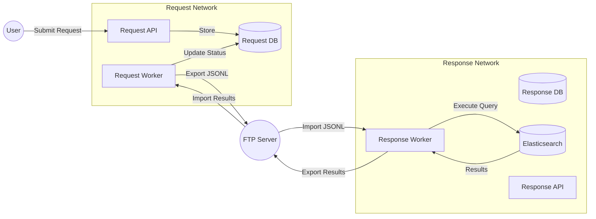

# System Architecture

## Overview
The system consists of two isolated networks: **Request Network** and **Response Network**, separated by an air-gap and synchronized via an **FTP Server**.

### 1. Request Network (Replica/Client Side)
- **Role**: Accepts user requests, validates them against cached policies, and exports them to the Response Network.
- **Core Components**:
  - **API Service** (`FastAPI`): Handles user interactions, authentication, and request submission.
  - **Database** (`PostgreSQL`): Stores requests, user replicas, and synced results.
  - **Redis**: Caches results and manages rate limiting.
  - **Celery Worker**: Handles background tasks (Export Requests, Import Results).
- **Security**:
  - RBAC: Users are restricted by `profile_type`.
  - "Deny All" Default: Users with no permissions cannot submit requests.

### 2. Response Network (Master/Processing Side)
- **Role**: The source of truth. Processes requests, executes queries against valid data sources (e.g., Elasticsearch), and returns results.
- **Core Components**:
  - **API Service** (`FastAPI`): Admin panel backend, configuration management.
  - **Database** (`PostgreSQL`): Master user table, profiles, request types, and audit logs.
  - **Elasticsearch**: The primary data source for executing queries.
  - **Celery Worker**: Handles background tasks (Import Requests, Execute Queries, Export Users/Results).
- **Security**:
  - **Data Integrity**: `ForeignKey` constraints enforce valid `profile_type` for all users.
  - **Source of Truth**: Permissions and Profiles are defined here and synced to Request Network.

### 3. FTP Middleware (The Bridge)
- **Role**: Acts as the data diode/bridge between the two networks.
- **Flow**:
  1.  **Requests**: Request Network -> FTP (`/requests`) -> Response Network.
  2.  **Results**: Response Network -> FTP (`/results`) -> Request Network.
  3.  **Users/Profiles**: Response Network -> FTP (`/users`) -> Request Network (Sync).

## Data Flow Diagram

## Security & Compliance
- **Orphan User Prevention**: Database constraints (`ForeignKey`) ensure no user exists without a valid profile.
- **RBAC**: Strict Role-Based Access Control. Permissions are defined in `ProfileTypeConfig` and strictly enforced.
- **Audit Logging**: All critical actions and data movements are logged.
